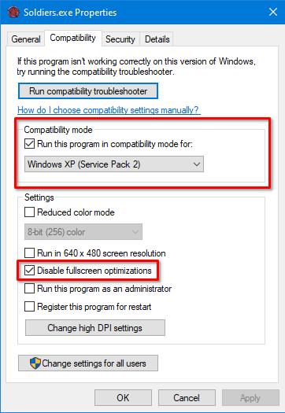

# Soldiers: Heroes of World War II widescreen fix
Widescreen and Resolution fix for Soldiers: Heroes of World War 2.

**It also fixes the famous `Texture or surface size is too big (esurface.cpp, 129)` error!**

## Installation

- Download zip from [releases](https://github.com/zocker-160/Soldiers-HoWW2-widescreen-fix/releases) and unpack the files inside next to the `Soldiers.exe`

- Set the following properties *(important)*

## Supported Versions

- [Zoom-Platform](https://www.zoom-platform.com/product/soldiers-heroes-of-world-war-ii)[^1] `1.28.3E`
    - `soldiers.exe` SHA256 `C46DBEF054FCFB9D0EE5DF2145763E1A0EA3FCB684DF4892F1E63C48A5B5D951`
- GOG `1.28.3E`
    - `Soldiers.exe` SHA256 `c46dbef054fcfb9d0ee5df2145763e1a0ea3fcb684df4892f1e63c48a5b5d951`

[^1]: THANK YOU guys for providing me a free copy for testing!!
    
## Known Limitations

- when the patched `d3d8.dll` is in the game folder, the editor will crash

## Showcase
### Main Menu

### Original Zoom

### Patched Zoom

